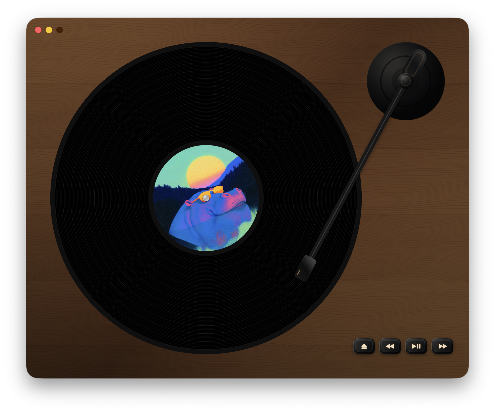

# Scamp Micro Deck

Scamp Micro Deck is a native macOS music player for local folders of audio files, designed to mimic the tedious charm of a real vinyl record player.

<!-- markdownlint-disable MD033 -->

  

  

<!-- markdownlint-enable MD033 -->

## Contributing

Issues and PRs welcome.

Tools:

- `mise test` - run the full test suite
- `mise simulate macos` - build and launch the macOS app
- `mise deploy:set-version 1.5.0` - update release and Xcode versions
- `mise publish` - archive, upload, submit, notarize, and publish a release

`mise publish` uses the App Store Connect, signing certificate, Codeberg, and GitHub credentials in the ignored `.env.production` file.

## License

MIT
